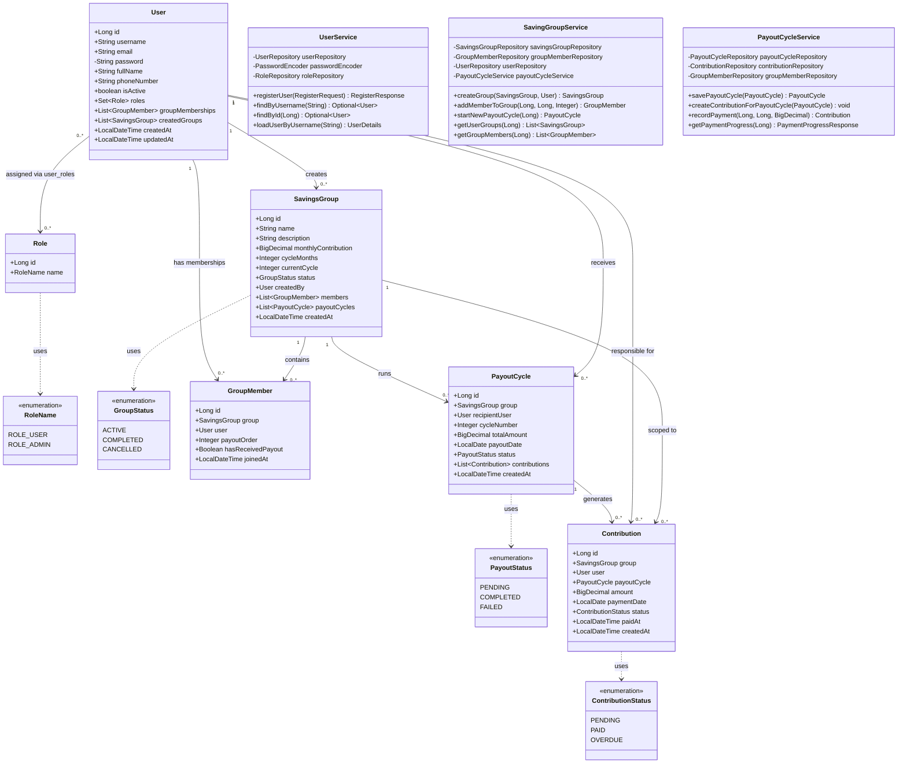

# Stockfela – Class Diagram

```mermaid
classDiagram
    direction TB

    class User {
        +Long id
        +String username
        +String email
        -String password
        +String fullName
        +String phoneNumber
        +boolean isActive
        +Set~Role~ roles
        +List~GroupMember~ groupMemberships
        +List~SavingsGroup~ createdGroups
        +LocalDateTime createdAt
        +LocalDateTime updatedAt
    }

    class Role {
        +Long id
        +RoleName name
    }

    class RoleName {
        <<enumeration>>
        ROLE_USER
        ROLE_ADMIN
    }

    class SavingsGroup {
        +Long id
        +String name
        +String description
        +BigDecimal monthlyContribution
        +Integer cycleMonths
        +Integer currentCycle
        +GroupStatus status
        +User createdBy
        +List~GroupMember~ members
        +List~PayoutCycle~ payoutCycles
        +LocalDateTime createdAt
    }

    class GroupStatus {
        <<enumeration>>
        ACTIVE
        COMPLETED
        CANCELLED
    }

    class GroupMember {
        +Long id
        +SavingsGroup group
        +User user
        +Integer payoutOrder
        +Boolean hasReceivedPayout
        +LocalDateTime joinedAt
    }

    class PayoutCycle {
        +Long id
        +SavingsGroup group
        +User recipientUser
        +Integer cycleNumber
        +BigDecimal totalAmount
        +LocalDate payoutDate
        +PayoutStatus status
        +List~Contribution~ contributions
        +LocalDateTime createdAt
    }

    class PayoutStatus {
        <<enumeration>>
        PENDING
        COMPLETED
        FAILED
    }

    class Contribution {
        +Long id
        +SavingsGroup group
        +User user
        +PayoutCycle payoutCycle
        +BigDecimal amount
        +LocalDate paymentDate
        +ContributionStatus status
        +LocalDateTime paidAt
        +LocalDateTime createdAt
    }

    class ContributionStatus {
        <<enumeration>>
        PENDING
        PAID
        OVERDUE
    }

    class UserService {
        -UserRepository userRepository
        -PasswordEncoder passwordEncoder
        -RoleRepository roleRepository
        +registerUser(RegisterRequest) RegisterResponse
        +findByUsername(String) Optional~User~
        +findById(Long) Optional~User~
        +loadUserByUsername(String) UserDetails
    }

    class SavingGroupService {
        -SavingsGroupRepository savingsGroupRepository
        -GroupMemberRepository groupMemberRepository
        -UserRepository userRepository
        -PayoutCycleService payoutCycleService
        +createGroup(SavingsGroup, User) SavingsGroup
        +addMemberToGroup(Long, Long, Integer) GroupMember
        +startNewPayoutCycle(Long) PayoutCycle
        +getUserGroups(Long) List~SavingsGroup~
        +getGroupMembers(Long) List~GroupMember~
    }

    class PayoutCycleService {
        -PayoutCycleRepository payoutCycleRepository
        -ContributionRepository contributionRepository
        -GroupMemberRepository groupMemberRepository
        +savePayoutCycle(PayoutCycle) PayoutCycle
        +createContributionForPayoutCycle(PayoutCycle) void
        +recordPayment(Long, Long, BigDecimal) Contribution
        +getPaymentProgress(Long) PaymentProgressResponse
    }

    %% Relationships
    User "1" --> "0..*" GroupMember : has memberships
    User "1" --> "0..*" SavingsGroup : creates
    User "0..*" --> "0..*" Role : assigned via user_roles
    SavingsGroup "1" --> "0..*" GroupMember : contains
    SavingsGroup "1" --> "0..*" PayoutCycle : runs
    PayoutCycle "1" --> "0..*" Contribution : generates
    User "1" --> "0..*" PayoutCycle : receives
    User "1" --> "0..*" Contribution : responsible for
    SavingsGroup "1" --> "0..*" Contribution : scoped to
    SavingsGroup ..> GroupStatus : uses
    PayoutCycle ..> PayoutStatus : uses
    Contribution ..> ContributionStatus : uses
    Role ..> RoleName : uses
```
