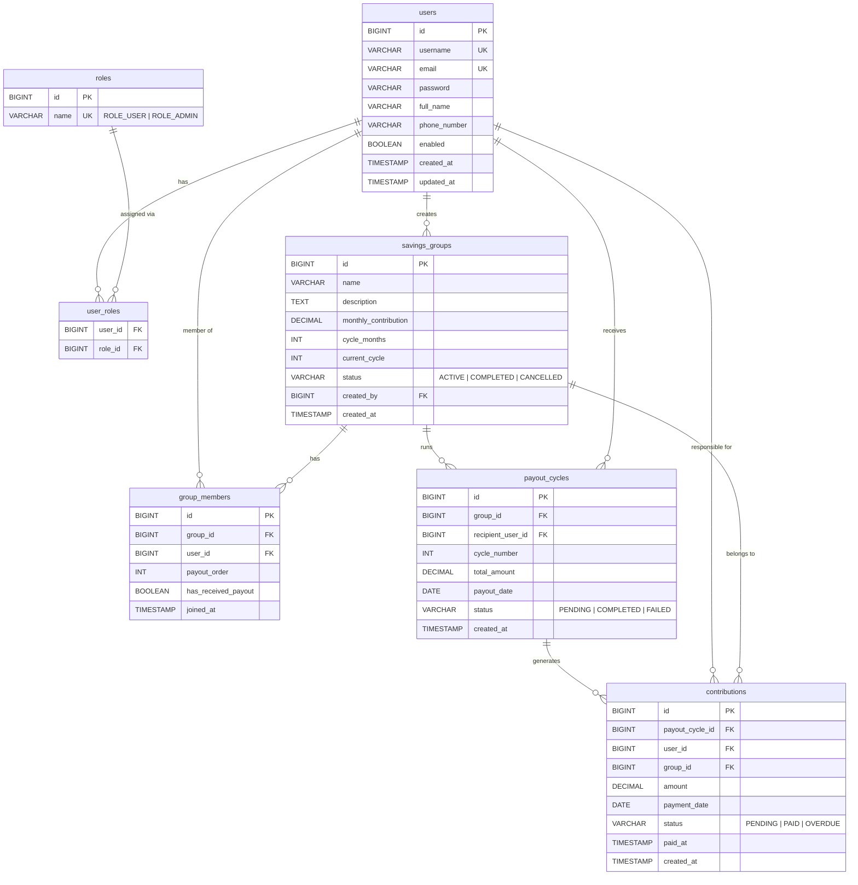

# Stockfela – Entity Relationship Diagram

Render this file in any Mermaid-compatible viewer (GitHub, VS Code Mermaid preview, etc.).

```mermaid
erDiagram
    users {
        BIGINT id PK
        VARCHAR username UK
        VARCHAR email UK
        VARCHAR password
        VARCHAR full_name
        VARCHAR phone_number
        BOOLEAN enabled
        TIMESTAMP created_at
        TIMESTAMP updated_at
    }

    roles {
        BIGINT id PK
        VARCHAR name UK "ROLE_USER | ROLE_ADMIN"
    }

    user_roles {
        BIGINT user_id FK
        BIGINT role_id FK
    }

    savings_groups {
        BIGINT id PK
        VARCHAR name
        TEXT description
        DECIMAL monthly_contribution
        INT cycle_months
        INT current_cycle
        VARCHAR status "ACTIVE | COMPLETED | CANCELLED"
        BIGINT created_by FK
        TIMESTAMP created_at
    }

    group_members {
        BIGINT id PK
        BIGINT group_id FK
        BIGINT user_id FK
        INT payout_order
        BOOLEAN has_received_payout
        TIMESTAMP joined_at
    }

    payout_cycles {
        BIGINT id PK
        BIGINT group_id FK
        BIGINT recipient_user_id FK
        INT cycle_number
        DECIMAL total_amount
        DATE payout_date
        VARCHAR status "PENDING | COMPLETED | FAILED"
        TIMESTAMP created_at
    }

    contributions {
        BIGINT id PK
        BIGINT payout_cycle_id FK
        BIGINT user_id FK
        BIGINT group_id FK
        DECIMAL amount
        DATE payment_date
        VARCHAR status "PENDING | PAID | OVERDUE"
        TIMESTAMP paid_at
        TIMESTAMP created_at
    }

    users ||--o{ user_roles : "has"
    roles ||--o{ user_roles : "assigned via"
    users ||--o{ savings_groups : "creates"
    users ||--o{ group_members : "member of"
    savings_groups ||--o{ group_members : "has"
    savings_groups ||--o{ payout_cycles : "runs"
    users ||--o{ payout_cycles : "receives"
    payout_cycles ||--o{ contributions : "generates"
    users ||--o{ contributions : "responsible for"
    savings_groups ||--o{ contributions : "belongs to"
```
