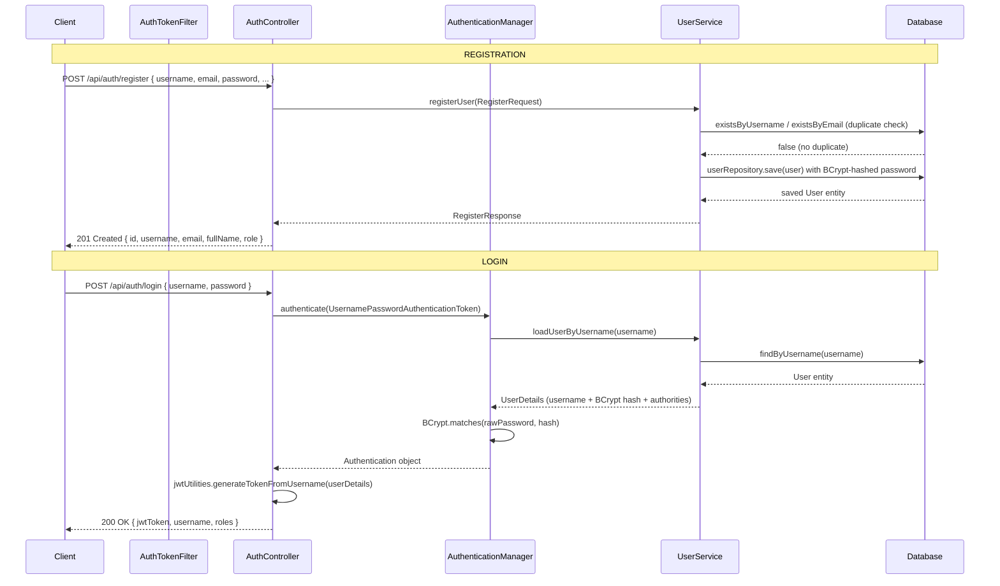
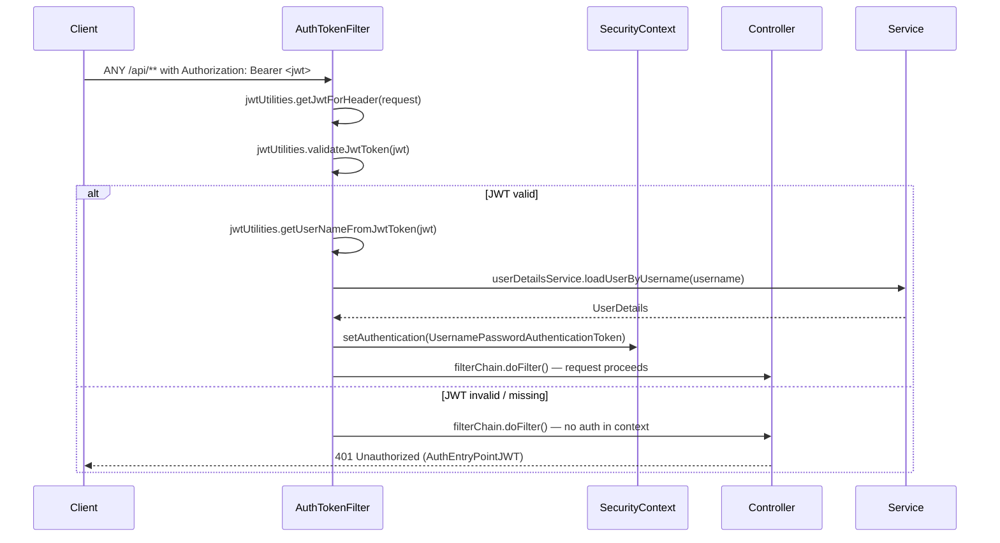
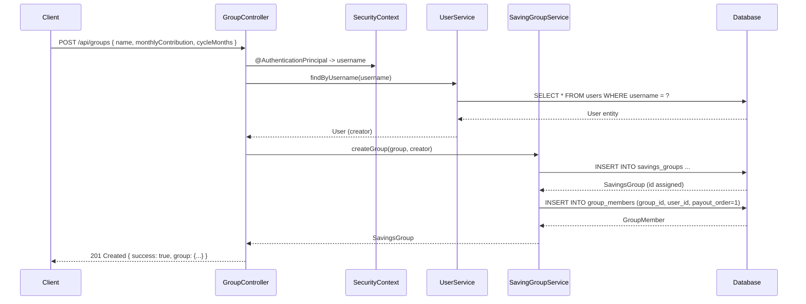
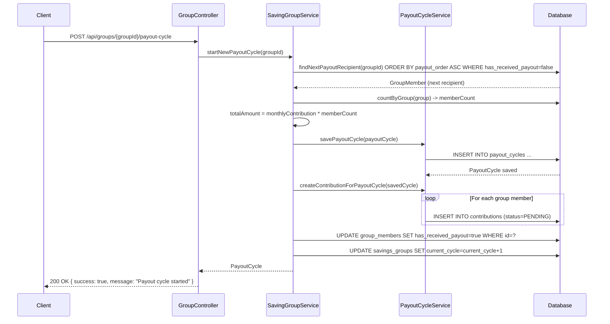
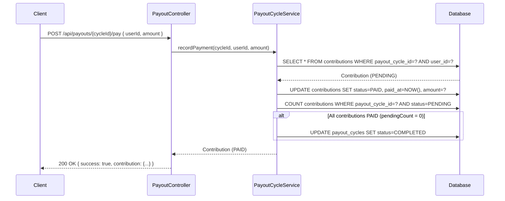

# Stockfela – Request Flow Diagrams

Render with Mermaid (GitHub, VS Code, etc.).

---

## 1. Authentication Flow

---

## 2. Authenticated Request Flow

---

## 3. Create Group Flow

---

## 4. Payout Cycle Flow

---

## 5. Record Payment Flow

